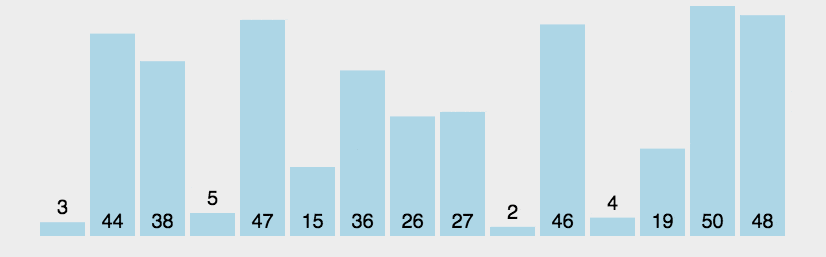

# Algorithm Questions

## 1. What are the time and space complexity for sorting algorithms

Most popular sorting algorithms:

### Selection Sort

- Works by finding the smallest value in the (remaining) list and swapping it with the item at the current position
- O(n^2) time on average and worst case
- O(1) space

### Bubble Sort

- Works by comparing the current item in the array with the item to its right. A swap is performed if the item to the right is larger than current item. This is performed n times in multiple (n) 'passes'
- O(n^2) time on average and worst case
- O(1) space

### Insertion Sort

- Works by keeping all items to the left of current item sorted (typically we start from second item). Current item is compared with previous items: while we find items larger than current item keep moving it left until it is "inserted" in its correct position
- O(n^2) time on average and worst case
- O(1) space

### Quick Sort

- Works by picking a value from the array to be a "pivot". Optimally this is chosen at random and swapped with the last item for convenience. We then partition the list such that the pivot is in the middle and all values less than the pivot are to its left and all values greater than the pivot are to its right. This is done recursively (until we only have one element left) using a divide and conquer approach
- O(n log n) time on average and O(n^2) in worst case
- O(n) space in worst case, O(1) if sorting the list in-place

### Merge Sort

- Works by continually dividing the list in half until only two sublists of one item remain. Then we merge (and compare) items in each sublist until we have sorted the entire list. This also uses a divide and conquer approach.
- O(n log n) time on average, and O(n log n) in worst case
- O(n) space - used in the merge step

