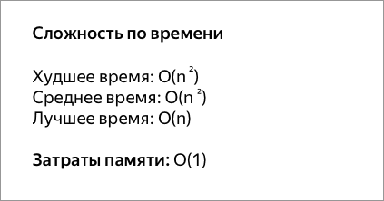
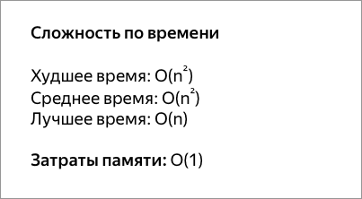
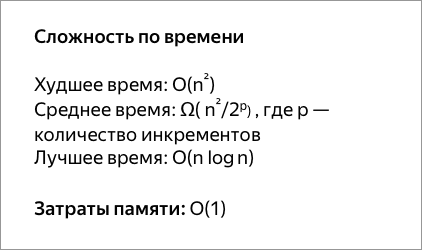
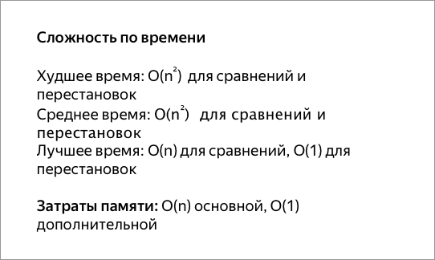
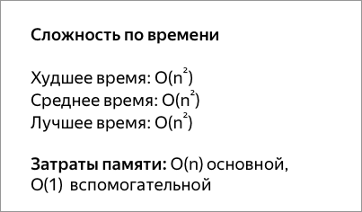
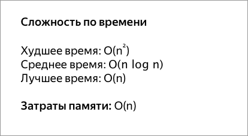
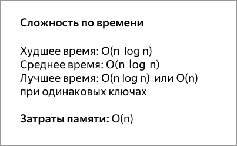

# Front-End Interview Questions

## 1. What are the time and space complexity for sorting algorithms

### Сортировка пузырьком

Один из самых известных алгоритмов сортировки. 
Здесь нужно последовательно сравнивать значения соседних элементов и 
менять числа местами, если предыдущее оказывается больше последующего. 
Таким образом элементы с большими значениями оказываются в конце списка, 
а с меньшими остаются в начале.

Этот алгоритм считается учебным и почти не применяется на практике из-за 
низкой эффективности: он медленно работает на тестах, в которых маленькие 
элементы (их называют «черепахами») стоят в конце массива. Однако на нём 
основаны многие другие методы, например, шейкерная 
сортировка и сортировка расчёской.

### Сортировка перемешиванием

Шейкерная сортировка отличается от пузырьковой тем, 
что она двунаправленная: алгоритм перемещается не строго слева направо, 
а сначала слева направо, затем справа налево.

### Сортировка расчёской

Сортировка расчёской — улучшение сортировки пузырьком. 
Её идея состоит в том, чтобы «устранить» элементы с небольшими значения в конце 
массива, которые замедляют работу алгоритма. Если при пузырьковой и шейкерной 
сортировках при переборе массива сравниваются соседние элементы, то при 
«расчёсывании» сначала берётся достаточно большое расстояние между 
сравниваемыми значениями, а потом оно сужается вплоть до минимального.

Первоначальный разрыв нужно выбирать не случайным образом, а с учётом специальной 
величины — фактора уменьшения, оптимальное значение которого равно 1,247. Сначала 
расстояние между элементами будет равняться размеру массива, поделённому на 1,247; 
на каждом последующем шаге расстояние будет снова делиться на фактор уменьшения — 
и так до окончания работы алгоритма.

### Сортировка вставками

При сортировке вставками массив постепенно перебирается слева 
направо. При этом каждый последующий элемент размещается так, чтобы он оказался между 
ближайшими элементами с минимальным и максимальным значением.

### Сортировка выбором

Сначала нужно рассмотреть подмножество массива и найти в нём максимум 
(или минимум). Затем выбранное значение меняют местами со значением первого неотсортированного 
элемента. Этот шаг нужно повторять до тех пор, пока в массиве не закончатся неотсортированные 
подмассивы.

### Быстрая сортировка

Этот алгоритм состоит из трёх шагов. Сначала из массива нужно выбрать 
один элемент — его обычно называют опорным. Затем другие элементы в массиве перераспределяют 
так, чтобы элементы меньше опорного оказались до него, а большие или равные — после. А дальше 
рекурсивно применяют первые два шага к подмассивам справа и слева от опорного значения.

Быструю сортировку изобрели в 1960 году для машинного перевода: тогда словари хранились на 
магнитных лентах, а сортировка слов обрабатываемого текста позволяла получить переводы за один 
прогон ленты, без перемотки назад.

### Сортировка слиянием

Сортировка слиянием пригодится для таких структур данных, в которых 
доступ к элементам осуществляется последовательно (например, для потоков). Здесь массив 
разбивается на две примерно равные части и каждая из них сортируется по отдельности. 
Затем два отсортированных подмассива сливаются в один.

### Пирамидальная сортировка

При этой сортировке сначала строится пирамида из элементов 
исходного массива. Пирамида (или двоичная куча) — это способ представления элементов, 
при котором от каждого узла может отходить не больше двух ответвлений. А значение в 
родительском узле должно быть больше значений в его двух дочерних узлах.

Пирамидальная сортировка похожа на сортировку выбором, где мы сначала ищем максимальный 
элемент, а затем помещаем его в конец. Дальше нужно рекурсивно повторять ту же операцию 
для оставшихся элементов.

